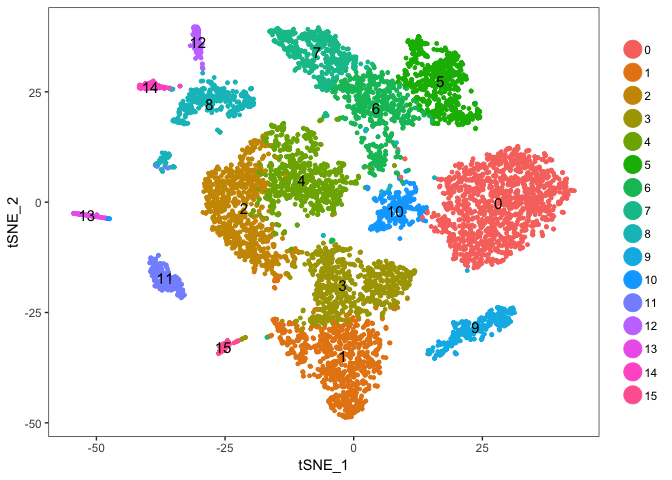
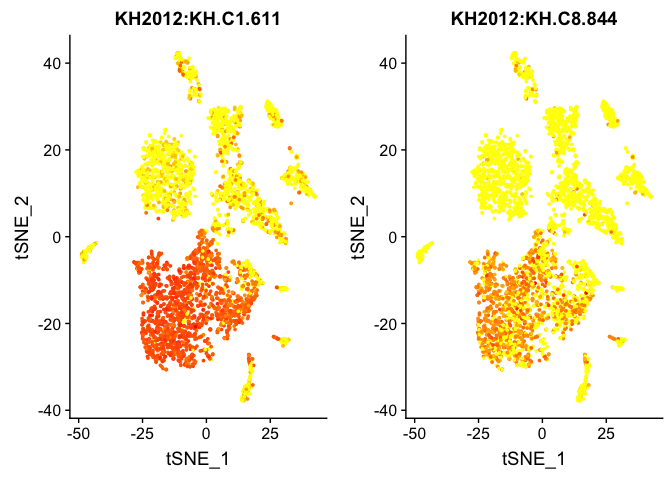
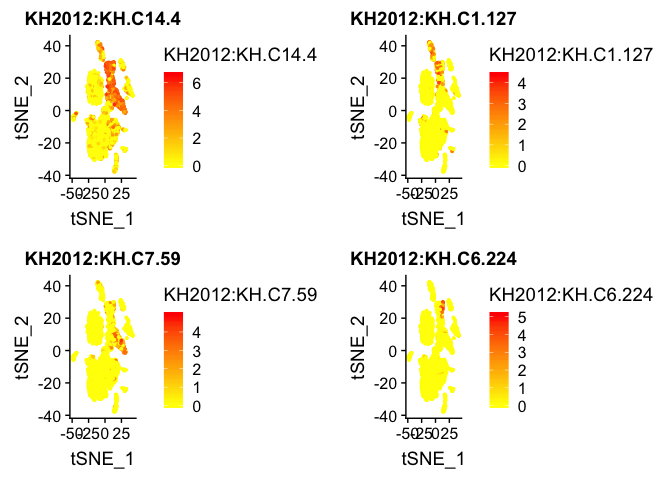
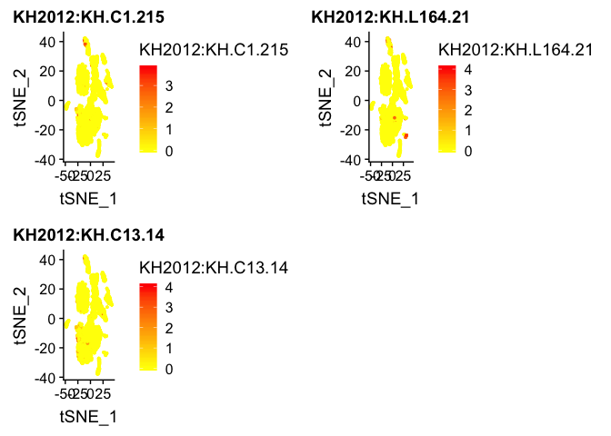
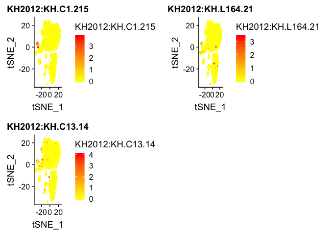
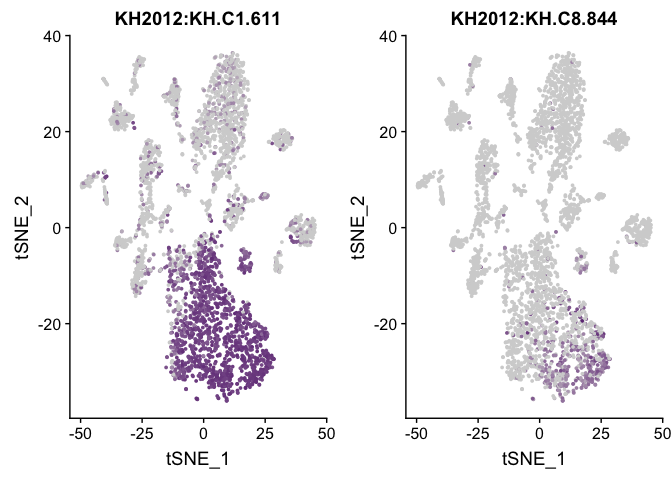
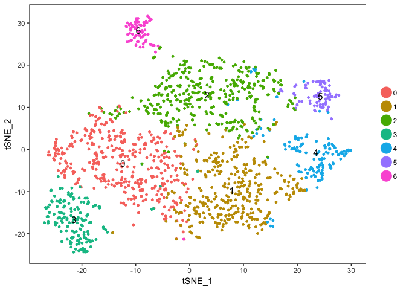
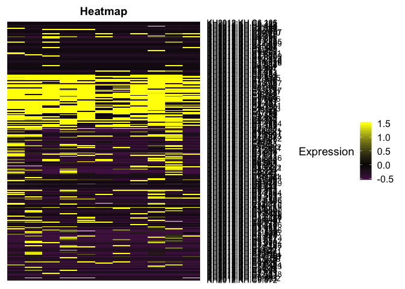
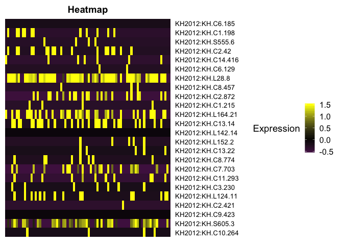

Final Pou4 Misexpression Analysis Pipeline
================

#### Analysis Pipeline for "Novel Neuronal Identities Derived by Misexpression of the POU IV Sensory Determinant in a Proto-Vertebrate"

##### Chacha et. al, PNAS 2022

------------------------------------------------------------------------

> Notes

-   This code is compatible with Seurat version 2.3.4.
-   Additional supplemental code for new visualizations and analyses is present in "final\_pou4\_revision\_code.Rmd" and is compatible with Seurat version 4.0.4.
-   As mentioned in "Materials and Methods" section, OE Cell refers to a cell in POU IV-misexpressed epidermis (ME). OE and ME are used interchangeably, and all code/lists use OE nomenclature.
-   "pou4\_data\_directory"- This directory only contains the raw CellRanger Count Files "matrix.mtx", "barcodes.tsv" and "genes.tsv", the necessary inputs to perform the subsequent analyses.
-   Rest of raw and processed data can be accessed from \[Insert GEO Link\]
-   Note: "agg" refers to the fact that this single-cell data contains cells from both WT and POU IV-misexpressed embryos.

``` r
# NOTE: Seurat v2.3.4, edgeR v3.22.3.
library(Seurat)
```

    ## Loading required package: ggplot2

    ## Loading required package: cowplot

    ## 
    ## Attaching package: 'cowplot'

    ## The following object is masked from 'package:ggplot2':
    ## 
    ##     ggsave

    ## Loading required package: Matrix

``` r
library(edgeR)
```

    ## Loading required package: limma

``` r
library(dplyr)
```

    ## 
    ## Attaching package: 'dplyr'

    ## The following objects are masked from 'package:stats':
    ## 
    ##     filter, lag

    ## The following objects are masked from 'package:base':
    ## 
    ##     intersect, setdiff, setequal, union

``` r
library(Matrix)
library(ggplot2)
```

``` r
# For the purpose of knitting this markdown, a local copy of the directory was used below.
agg_data_dir <- "/Volumes/GoogleDrive/My Drive/Levine Lab/Pou4_Paper/revisions/revised_PNAS/pou4_OE_data/raw_gene_bc_matrices_mex/ci_kh_ghostdb_mchsv40_cfpsv40"
```

##### Relevant Markers.

``` r
# General Tissue Markers
epi_markers <- c("KH2012:KH.C1.611", "KH2012:KH.C8.844")
cns_markers <- c("KH2012:KH.C14.4", "KH2012:KH.C1.127", "KH2012:KH.C7.59", "KH2012:KH.C6.224")
dopa_markers <- c("KH2012:KH.C10.200", "KH2012:KH.C3.666")

# Sensory Neuron Markers
pou4 <- "KH2012:KH.C2.42"

## BTN 
asic1b <- "KH2012:KH.C1.215"
synaphin <- "KH2012:KH.L164.21"
btn_markers <- c(asic1b, synaphin, "KH2012:KH.C13.14")

## aATEN
gnrh2 <- "KH2012:KH.C9.484"
gshr <- "KH2012:KH.C1.315"
aaten_markers <- c(gnrh2, gshr)
# additional aATEN marker
six_12 = "KH2012:KH.C3.553"

## PSC 
islet <- "KH2012:KH.L152.2"
sp8 <- "KH2012:KH.C13.22"
foxg <- "KH2012:KH.C8.774"
psc_markers <- c(islet, sp8, foxg)

## CESN
klf <- "KH2012:KH.C5.154"
ng <- "KH2012:KH.C6.129"
b_thymosine <- "KH2012:KH.C2.140"
```

### (1) Make agg\_seurat\_object to retrieve raw data and for visualizations.

``` r
agg_data_mat <- Read10X(agg_data_dir)

agg_seurat <- CreateSeuratObject(raw.data = agg_data_mat, min.cells = 3, min.genes = 200)
agg_seurat <- NormalizeData(agg_seurat)
agg_seurat <- ScaleData(agg_seurat, use.umi = TRUE)
```

    ## Scaling data matrix

``` r
agg_seurat <- FindVariableGenes(object = agg_seurat, 
                                   do.plot = FALSE)
pc_num <- 10 
agg_seurat <- RunPCA(agg_seurat, pcs.compute = pc_num, do.print = FALSE)
agg_seurat <- RunTSNE(agg_seurat, dims.use = 1:pc_num)
agg_seurat <- FindClusters(object = agg_seurat,
                          reduction.type = 'pca',
                          dims.use = 1:pc_num,
                          print.output = FALSE)
```

``` r
TSNEPlot(agg_seurat, do.label = TRUE)
```



##### Helper Function to get WT (-2) and OE (-1) cell names

``` r
substrRight <- function(x, n) {
  # Get 2nd to last character in a string.
  substr(x, nchar(x)-n+1, nchar(x))
}

get_combo_cells <- function(all_cells) {
  # Gets all cells with identity 1 (barcode = 1). These correspond to OE cells.
  # Args:
  #   all_cells: all cell names present in agg_seurat.
  #
  # Returns:
  #   oe_cells: names of cells from POU IV-misexpressed embryos.
  #
  # e.g. "ACTGAGTTCTGGTGTA-2" is a WT cell.
  #      "ACTGAGTTCTGGTGTA-1" is an OE cell. 
  oe_cells <- c()
  for (i in 1:length(all_cells)){
    barcode <- all_cells[i]
    substr <- substrRight(barcode, 2)
    if ("-1" == substr) {
      oe_cells <- c(oe_cells, barcode)
    }
  }
  return(oe_cells)
}
```

#### Get names of WT and OE Cells.

``` r
# 7799 
all_cells <- agg_seurat@cell.names
# 3884
oe_cells <- get_combo_cells(all_cells)
# 3915
wt_cells <- setdiff(all_cells, oe_cells)
```

### (2) Get epi and cns9 clusters from wt\_seurat object.

#### WT Seurat: Get raw data for WT.

``` r
raw_mat <- agg_seurat@raw.data
# genes x cells = 13657 x 3915
wt_mat <- raw_mat[, wt_cells]
```

#### WT Seurat: Make Seurat -&gt; Scale Data.

``` r
# 12600 x 3915
wt_seurat <- CreateSeuratObject(raw.data = wt_mat,
                               min.cells = 3, 
                               min.genes = 200)
wt_seurat <- NormalizeData(wt_seurat)
wt_seurat <- ScaleData(wt_seurat, use.umi = TRUE)
```

    ## Scaling data matrix

#### WT Seurat: Variable Genes -&gt; Find Clusters.

``` r
wt_pc_num <- 10
wt_seurat <- FindVariableGenes(object = wt_seurat,
                               do.plot = FALSE)
wt_seurat <- RunPCA(wt_seurat, pcs.compute = wt_pc_num, do.print = FALSE)
wt_seurat <- RunTSNE(wt_seurat, dims.use = 1:wt_pc_num)
wt_seurat <- FindClusters(object = wt_seurat,
                          reduction.type = 'pca',
                          dims.use = 1:wt_pc_num,
                          plot.SNN = TRUE,
                          print.output = FALSE)
```

#### WT Seurat: Plot Clusters.

``` r
TSNEPlot(wt_seurat, do.label = TRUE)
```



#### WT Seurat: Identify Epi.

``` r
# Clusters 0, 2, 3, 8
FeaturePlot(wt_seurat, 
            features.plot = epi_markers, 
            no.legend = TRUE)
```


#### WT Seurat: Identify CNS.

``` r
# Clusters 4, 5, 6, 9
FeaturePlot(wt_seurat, 
            features.plot = cns_markers,
            no.legend = FALSE)
```



#### WT Seurat: Identify CNS cluster with BTN Markers.

``` r
# Cluster 9 
FeaturePlot(wt_seurat, 
            features.plot = btn_markers,
            no.legend = FALSE)
```



#### WT Seurat: Get names of Epi and CNS cells.

##### Also get names of cells in CNS9 cluster (has BTNs).

``` r
# 1735
wt_epi_cells <- WhichCells(wt_seurat, ident = c(8, 0, 3, 2))
# 917 
wt_cns_cells <- WhichCells(wt_seurat, ident = c(9, 4, 5, 6))
# Contains all epi cells and 1 CNS cluster that contains BTNs (Cluster 9)
# 1888
wt_epi_cns9_cells <- WhichCells(wt_seurat, ident = c(9, 8, 0, 3, 2))
```

### (3) Identify sensory cells using wt\_epi\_cns9\_seurat object.

#### wt\_epi\_cns9 Seurat: Get raw data for wt\_epi\_cns9 cells.

``` r
# 13657 x 1888
wt_epi_cns9_mat <- raw_mat[, wt_epi_cns9_cells]
```

#### wt\_epi\_cns9 Seurat: Make Seurat -&gt; Scale Data.

``` r
# 11543 x 1888
wt_epi_cns9_seurat <- CreateSeuratObject(raw.data = wt_epi_cns9_mat,
                                         min.cells = 3, 
                                         min.genes = 200)
wt_epi_cns9_seurat <- NormalizeData(wt_epi_cns9_seurat)
wt_epi_cns9_seurat <- ScaleData(wt_epi_cns9_seurat, use.umi = TRUE)
```

    ## Scaling data matrix

#### wt\_epi\_cns9 Seurat: Variable Genes -&gt; Find Clusters.

``` r
wt_epi_cns9_pc_num <- 10
wt_epi_cns9_seurat <- FindVariableGenes(object = wt_epi_cns9_seurat,
                               do.plot = FALSE)
wt_epi_cns9_seurat <- RunPCA(wt_epi_cns9_seurat, pcs.compute = wt_epi_cns9_pc_num, do.print = FALSE)
wt_epi_cns9_seurat <- RunTSNE(wt_epi_cns9_seurat, dims.use = 1:wt_epi_cns9_pc_num)
wt_epi_cns9_seurat <- FindClusters(object = wt_epi_cns9_seurat,
                                   reduction.type = 'pca',
                                   dims.use = 1:wt_epi_cns9_pc_num,
                                   plot.SNN = TRUE,
                                   resolution = 0.6,
                                   print.output = FALSE)
```

#### wt\_epi\_cns9\_seurat Seurat: Plot Clusters.

``` r
TSNEPlot(wt_epi_cns9_seurat)
```



#### Visualize BTN Markers.

``` r
# BTNs present in Cluster 5
FeaturePlot(wt_epi_cns9_seurat, 
            features.plot = c(btn_markers),
            no.legend = FALSE)
```


#### Identify BTNs.

``` r
# 11 
btn_cells <- intersect(WhichCells(wt_epi_cns9_seurat,
                         subset.name = asic1b,
                         accept.low = 0.01),
                       WhichCells(wt_epi_cns9_seurat,
                         subset.name = synaphin,
                         accept.low = 0.01))
```

#### aATENs.

``` r
# 4
aaten_cells <- intersect(WhichCells(wt_epi_cns9_seurat,
                         subset.name = aaten_markers[1],
                         accept.low = 0.01),
                       WhichCells(wt_epi_cns9_seurat,
                         subset.name = aaten_markers[2],
                         accept.low = 0.01))
```

#### PSCs.

``` r
# 21 
psc_cells <- intersect(
  intersect(WhichCells(wt_epi_cns9_seurat,
                         subset.name = psc_markers[1],
                         accept.low = 0.01),
            WhichCells(wt_epi_cns9_seurat,
                         subset.name = psc_markers[2],
                         accept.low = 0.01)),
                       WhichCells(wt_epi_cns9_seurat,
                         subset.name = psc_markers[3],
                         accept.low = 0.01))
```

#### CESNs (cesn\_3).

``` r
pou4_cesn_cells <- WhichCells(wt_epi_cns9_seurat,
                         subset.name = pou4,
                         accept.low = 0.01,
                         ident = 2)

klf_cesn_cells <- WhichCells(wt_epi_cns9_seurat,
                         subset.name = klf,
                         accept.low = 0.01,
                         ident = 2)

b_thymosine_cesn_cells_low <- WhichCells(wt_epi_cns9_seurat,
                         subset.name = b_thymosine,
                         ident = 2,
                         accept.low = 0.01)

ng_cesn_cells <- WhichCells(wt_epi_cns9_seurat,
                         subset.name = ng,
                         accept.low = 0.01,
                         ident = 2)
# 26
cesn_3 <- intersect(pou4_cesn_cells,
                    intersect(klf_cesn_cells, b_thymosine_cesn_cells_low))
# 26
cesn_3 <- setdiff(cesn_3, ng_cesn_cells)
```

#### Also update only\_wt\_epi\_cells.

``` r
# 1683
only_wt_epi_cells <- setdiff(wt_epi_cells, c(aaten_cells, btn_cells, cesn_3, psc_cells))
# 26
cesn_3 <- setdiff(cesn_3, only_wt_epi_cells)

cesn_cells <- cesn_3
```

### (4) Make sure there are no overlaps in lists of cell names!

##### There are none.

``` r
length(intersect(aaten_cells, btn_cells))
```

    ## [1] 0

``` r
length(intersect(aaten_cells, cesn_cells))
```

    ## [1] 0

``` r
length(intersect(aaten_cells, psc_cells))
```

    ## [1] 0

``` r
length(intersect(aaten_cells, only_wt_epi_cells))
```

    ## [1] 0

``` r
length(intersect(btn_cells, cesn_cells))
```

    ## [1] 0

``` r
length(intersect(btn_cells, psc_cells))
```

    ## [1] 0

``` r
length(intersect(btn_cells, only_wt_epi_cells))
```

    ## [1] 0

``` r
length(intersect(cesn_cells, psc_cells))
```

    ## [1] 0

``` r
length(intersect(cesn_cells, only_wt_epi_cells))
```

    ## [1] 0

``` r
length(intersect(psc_cells, only_wt_epi_cells))
```

    ## [1] 0

### (5) Make Raw Mats for Sensory Cell Types.

``` r
# 13567 x 11
aaten_raw_mat <- wt_mat[, aaten_cells]
# 11
btn_raw_mat <- wt_mat[, btn_cells]
# 26
cesn_raw_mat <- wt_mat[, cesn_cells]
# 21
psc_raw_mat <- wt_mat[, psc_cells]
# 1683
only_wt_epi_raw_mat <- wt_mat[, only_wt_epi_cells]
```

### (6) Make oe\_seurat object -&gt; Get Raw Epi OE Cell Data.

#### OE Seurat: Get OE raw data.

``` r
# 13657 x 3884
oe_mat <- raw_mat[, oe_cells]
```

#### OE Seurat: Make Seurat -&gt; Scale Data.

``` r
# 13137 x 3884
oe_seurat <- CreateSeuratObject(raw.data = oe_mat,
                               min.cells = 3, 
                               min.genes = 200)

oe_seurat <- NormalizeData(oe_seurat)

oe_seurat <- ScaleData(oe_seurat, use.umi = TRUE)
```

    ## Scaling data matrix

#### OE Seurat: Variable Genes -&gt; Find Clusters.

``` r
oe_pc_num <- 16
oe_seurat <- FindVariableGenes(object = oe_seurat,
                               do.plot = FALSE)

oe_seurat <- RunPCA(oe_seurat, pcs.compute = oe_pc_num, do.print = FALSE)
oe_seurat <- RunTSNE(oe_seurat, dims.use = 1:oe_pc_num)
oe_seurat <- FindClusters(object = oe_seurat,
                          reduction.type = 'pca',
                          dims.use = 1:oe_pc_num,
                          plot.SNN = TRUE,
                          print.output = FALSE)
```

#### OE Seurat: Plot Clusters.

``` r
TSNEPlot(oe_seurat, do.label = TRUE)
```



#### OE Seurat: Identify Epi.

``` r
# Clusters 1, 2, 3, 9
FeaturePlot(oe_seurat, 
            features.plot = epi_markers,
            no.legend = TRUE,
            cols.use = c("lightgrey", "#6C3483"))
```


#### OE Seurat: Get OE Epi cells.

``` r
# 1570 
oe_epi_cells <- WhichCells(oe_seurat, ident = c(1, 2, 3, 9))

# 13657 x 1570 
oe_epi_raw_mat <- oe_mat[, oe_epi_cells]
```

#### OE Epi Seurat: Make Seurat -&gt; Scale Data.

``` r
# 12127 x 1570 
oe_epi_seurat <- CreateSeuratObject(raw.data = oe_epi_raw_mat,
                               min.cells = 3, 
                               min.genes = 200)

oe_epi_seurat <- NormalizeData(oe_epi_seurat)

oe_epi_seurat <- ScaleData(oe_epi_seurat, use.umi = TRUE)
```

    ## Scaling data matrix

#### OE Epi Seurat: Variable Genes -&gt; Find Clusters.

``` r
oe_epi_pc_num <- 8
oe_epi_seurat <- FindVariableGenes(object = oe_epi_seurat,
                               do.plot = FALSE)

oe_epi_seurat <- RunPCA(oe_epi_seurat, pcs.compute = oe_epi_pc_num, do.print = FALSE)
oe_epi_seurat <- RunTSNE(oe_epi_seurat, dims.use = 1:oe_epi_pc_num)
```

#### OE Epi Seurat: Subcluster OE Epi Cells!

``` r
oe_epi_seurat <- FindClusters(object = oe_epi_seurat,
                          reduction.type = 'pca',
                          dims.use = 1:oe_epi_pc_num,
                          resolution = 0.5,
                          plot.SNN = TRUE,
                          print.output = FALSE)
```

#### Visualize.

``` r
TSNEPlot(oe_epi_seurat, do.label = TRUE)
```



#### **Get the cells from each OE subcluster.**

``` r
oe_epi_0 = WhichCells(oe_epi_seurat, ident = 0) 
oe_epi_1 = WhichCells(oe_epi_seurat, ident = 1)
oe_epi_2 = WhichCells(oe_epi_seurat, ident = 2)
oe_epi_3 = WhichCells(oe_epi_seurat, ident = 3)
oe_epi_4 = WhichCells(oe_epi_seurat, ident = 4)
oe_epi_5 = WhichCells(oe_epi_seurat, ident = 5)
oe_epi_6 = WhichCells(oe_epi_seurat, ident = 6)
```

### (7) Get DEGs for downstream Linear Model Analysis in Matlab.

#### Helper Functions

##### Step 1: Perform edgeR.

``` r
edgeR_pipeline <- function(pair_mat, rep_1, rep_2) {
  # Computes differentially expressed genes (DEGs) between two samples.
  # These DEGs are for rep_1 sample with respect to rep_2 sample.
  
  # Args:
  #   pair_mat: matrix with raw gene expression values of the two samples. 
  #             e.g. psc_cesn_mat.
  #   rep_1 and rep_2: numbers in each sample.
  #
  # Returns:
  #   edgeR_deg_df: dataframe with logFC, logCPM, F, PValue 
  #                 statistics for the DEGs.
  #
  # e.g. "psc_v_cesn_res" is a dataframe that contains DEGs and mentioned
  #       statistics for PSCs when expression values of CESNs are used as
  #       the background.
  
  group = factor(c(rep(1, rep_1), rep(2, rep_2)))
  y = DGEList(counts=pair_mat, group=group)
  y = calcNormFactors(y)
  design = model.matrix(~group)
  y = estimateDisp(y, design)
  
  fit <- glmQLFit(y,design)
  qlf <- glmQLFTest(fit,coef=2)
  edgeR_deg_df <- qlf$table
  edgeR_res <- edgeR_deg_df
  
  return(edgeR_res)
}
```

##### Step 2: Adjust p-values.

``` r
adj_adjust_p = function(edgeR_res) {
  # Returns edgeR_deg_df with an additional column with adjusted p values. 
  # e.g. "psc_v_cesn_res_p"
  adj_p_vals <- p.adjust(edgeR_res$PValue, method="fdr", nrow(edgeR_res))
  edgeR_res$adj_PValue = adj_p_vals
  return(edgeR_res)
}
```

##### Step 3: Filter edgeR\_deg\_df by adjusted p-value.

``` r
filter_edgeR_markers_pval <- function(edgeR_res) {
  filtered_res = edgeR_res[which(edgeR_res$adj_PValue < 0.05), ]
  return(filtered_res)
}
```

##### Step 4: Filter edgeE\_deg\_df by logFC &lt; 0.

``` r
filter_edgeR_markers <- function(edgeR_res) {
  filtered_res = edgeR_res[which(edgeR_res$logFC < 0), ]
  return(filtered_res)
}
```

##### CESN vs. PSC

###### There are 2 NA's/48 DEGs after stringent filtering of CESN DEGs.

``` r
cesn_psc_mat <- as.matrix(cbind(cesn_raw_mat, psc_raw_mat))
# Do edgeR.
cesn_v_psc_res <- edgeR_pipeline(cesn_psc_mat, ncol(cesn_raw_mat), ncol(psc_raw_mat))

# Add the adj p-value column.
cesn_v_psc_res_p <- adj_adjust_p(cesn_v_psc_res)

# Filter based on adj p-vals < 0.05.
# We get 48 DEGs.
cesn_v_psc_res_p_1 <- filter_edgeR_markers_pval(cesn_v_psc_res_p)

# Filter and Order by logFC.
cesn_v_psc_res_p_1b <- filter_edgeR_markers(cesn_v_psc_res_p_1)
cesn_v_psc_res_p_1c <- cesn_v_psc_res_p_1b[order(cesn_v_psc_res_p_1b$logFC), ]

# Take top 50 = putative DEGs.
putative_CESN_degs <- rownames(cesn_v_psc_res_p_1c)[1:48]
```

##### PSC vs. CESN

``` r
psc_cesn_mat <- as.matrix(cbind(psc_raw_mat, cesn_raw_mat))
# Do edgeR.
psc_v_cesn_res <- edgeR_pipeline(psc_cesn_mat, ncol(psc_raw_mat), ncol(cesn_raw_mat))

# Add the adj p-value column.
psc_v_cesn_res_p <- adj_adjust_p(psc_v_cesn_res)

# Filter based on adj p-vals < 0.05.
psc_v_cesn_res_p <- filter_edgeR_markers_pval(psc_v_cesn_res_p)

# Filter and Order by logFC.
psc_v_cesn_res_p <- filter_edgeR_markers(psc_v_cesn_res_p)
psc_v_cesn_res_p_2 <- psc_v_cesn_res_p[order(psc_v_cesn_res_p$logFC), ]

# Take top 50.
putative_PSC_degs <- rownames(psc_v_cesn_res_p_2)[1:50]
```

##### aATEN vs. CESN+PSC

``` r
not_aaten_mat <- cbind(cesn_raw_mat, psc_raw_mat)
aaten_v_all_mat <- as.matrix(cbind(aaten_raw_mat, not_aaten_mat))

# Do edgeR.
aaten_v_all_res <- edgeR_pipeline(aaten_v_all_mat, ncol(aaten_raw_mat), ncol(not_aaten_mat))

# We do not adjust because we are left with only ~10 DEGs.
aaten_v_all_res_p <- filter_edgeR_markers(aaten_v_all_res)

# Order by logFC.
aaten_v_all_res_p_2 <- aaten_v_all_res_p[order(aaten_v_all_res_p$logFC), ]

# Take top 50.
putative_aaten_degs <- rownames(aaten_v_all_res_p_2)[1:50]
```

##### BTN vs. all other Sensory Cell Types (including WT Epidermis)

``` r
not_btn_mat <- cbind(aaten_raw_mat, cesn_raw_mat, psc_raw_mat, only_wt_epi_raw_mat)
btn_v_all_mat <- as.matrix(cbind(btn_raw_mat, not_btn_mat))

# Do edgeR.
btn_v_all_res <- edgeR_pipeline(btn_v_all_mat, ncol(btn_raw_mat), ncol(not_btn_mat))

# Add the adj p-value column.
btn_v_all_res_p <- adj_adjust_p(btn_v_all_res)

# Filter based on adj p-vals < 0.05.
btn_v_all_res_p <- filter_edgeR_markers_pval(btn_v_all_res_p)

# Fiter and Order by logFC.
btn_v_all_res_p <- filter_edgeR_markers(btn_v_all_res_p)
btn_v_all_res_p_2 <- btn_v_all_res_p[order(btn_v_all_res_p$logFC), ]

# Take top 50.
putative_BTN_degs <- rownames(btn_v_all_res_p_2)[1:50]
```

##### Only WT Epi vs. all other WT Sensory Cell Types

``` r
not_wt_epi_mat <- cbind(aaten_raw_mat, btn_raw_mat, cesn_raw_mat, psc_raw_mat)
wt_epi_v_all_mat <- as.matrix(cbind(only_wt_epi_raw_mat, not_wt_epi_mat))

# Do edgeR.
wt_epi_v_all_res <- edgeR_pipeline(wt_epi_v_all_mat, ncol(only_wt_epi_raw_mat), ncol(not_wt_epi_mat))

# We do not adjust because we are left with only 28 DEGs.
wt_epi_v_all_res_p <- filter_edgeR_markers(wt_epi_v_all_res)

# Order by logFC.
wt_epi_v_all_res_p_2 <- wt_epi_v_all_res_p[order(wt_epi_v_all_res_p$logFC), ]

# Take top 50.
putative_WT_EPI_degs <- rownames(wt_epi_v_all_res_p_2)[1:50]
```

##### OE Epi vs. all Sensory Cell Types (including WT Epidermis)

``` r
not_oe_epi_mat <- cbind(aaten_raw_mat, btn_raw_mat, cesn_raw_mat, psc_raw_mat, only_wt_epi_raw_mat)
oe_epi_v_all_mat <- as.matrix(cbind(oe_epi_raw_mat, not_oe_epi_mat))

# Do edgeR.
oe_epi_v_all_res <- edgeR_pipeline(oe_epi_v_all_mat, ncol(oe_epi_raw_mat), ncol(not_oe_epi_mat))

# Add the adj p-value column.
oe_epi_v_all_res_p <- adj_adjust_p(oe_epi_v_all_res)

# Filter based on adj p-vals < 0.05
oe_epi_v_all_res_p <- filter_edgeR_markers_pval(oe_epi_v_all_res_p)

# Filter and Order by logFC. 
oe_epi_v_all_res_p <- filter_edgeR_markers(oe_epi_v_all_res_p)
oe_epi_v_all_res_p_2 <- oe_epi_v_all_res_p[order(oe_epi_v_all_res_p$logFC), ]

# Take top 50
putative_OE_EPI_degs <- rownames(oe_epi_v_all_res_p_2)[1:50]
```

### (8) Create 2 Transcriptomic Profiles

-   "putative\_txn\_profile\_300" contains 50 DEGs from all 6 cell populations.
-   "putative\_txn\_profile\_250" contains 50 DEGs from all cell populations except from OE Cells. This profile will be used for downstream Linear Model Analysis.

``` r
putative_txn_profile_300 <- c(putative_aaten_degs, putative_BTN_degs, putative_CESN_degs, putative_PSC_degs, putative_WT_EPI_degs, putative_OE_EPI_degs)
putative_txn_profile_250 <- c(putative_aaten_degs, putative_BTN_degs, putative_CESN_degs, putative_PSC_degs, putative_WT_EPI_degs)
```

##### There are 2 NA's- remove them.

``` r
# 298
cleaned_putative_txn_profile_300 <- putative_txn_profile_300[!is.na(putative_txn_profile_300)]
# 248
cleaned_putative_txn_profile_250 <- putative_txn_profile_250[!is.na(putative_txn_profile_250)]
```

#### Visualize the Transcriptomic Profiles.

``` r
DoHeatmap(wt_seurat, 
          genes.use = cleaned_putative_txn_profile_250, 
          do.plot = TRUE,
          group.spacing = 1, 
          draw.line = TRUE,
          group.by = NULL,
          slim.col.label = TRUE,
          remove.key = FALSE,
          cells.use = btn_cells,
          disp.min = -0.5,
          disp.max = 1.5,
          title = "Heatmap")
```



``` r
test <- DoHeatmap(wt_seurat, 
          genes.use = cleaned_putative_txn_profile_300, 
          do.plot = TRUE,
          group.spacing = 1, 
          draw.line = TRUE,
          group.by = NULL,
          slim.col.label = TRUE,
          remove.key = FALSE,
          cells.use = btn_cells,
          disp.min = -0.5,
          disp.max = 1.5,
          title = "Heatmap")
```

### (9) Also Visualize Hybrid BTN/PSC Phenotype

##### Relevant BTN + PSC Markers

``` r
## BTNs 
# TFs 
hnf6 <- "KH2012:KH.C6.185"
mta2 <- "KH2012:KH.C1.198"
sir_4_5 <- "KH2012:KH.S555.6"
coe <- "KH2012:KH.L24.10"
jnk <- "KH2012:KH.C14.416"

# Signaling Molecules 
fgf_11_12 <- "KH2012:KH.L28.8"
apc <- "KH2012:KH.C8.457"
gna_1_2_3 <- "KH2012:KH.C2.872"

# Effectors 
# asic1b, synaphin
annexin <- "KH2012:KH.C13.14"

## PSCs
# TFs 
emx <- "KH2012:KH.L142.14"
islet <- "KH2012:KH.L152.2"
sp8 <- "KH2012:KH.C13.22"
foxg <- "KH2012:KH.C8.774"
eya <- "KH2012:KH.C7.703"
egf_like <- "KH2012:KH.C11.293"
smad_2_6_7 <- "KH2012:KH.C3.230"
rxfp1 <- "KH2012:KH.L124.11"
bmp_2_3 <- "KH2012:KH.C2.421"

# Effectors 
sulfotrans <- "KH2012:KH.C9.423"
crystallin <- "KH2012:KH.S605.3"
msh1 <- "KH2012:KH.C10.264"

btn_battery <- c(hnf6, mta2, sir_4_5, pou4, jnk, ng, fgf_11_12, apc, gna_1_2_3, asic1b, synaphin, annexin)
psc_battery <- c(emx, islet, sp8, foxg, eya, egf_like, smad_2_6_7, rxfp1, bmp_2_3, sulfotrans, crystallin, msh1)
```

#### Visualize Marker Expression in OE Cells.

``` r
DoHeatmap(oe_seurat, 
          genes.use = c(btn_battery, psc_battery), 
          do.plot = TRUE,
          group.spacing = 1, 
          draw.line = TRUE,
          group.by = NULL,
          slim.col.label = TRUE,
          remove.key = FALSE,
          cells.use = oe_epi_5,
          disp.min = -0.5,
          disp.max = 1.5,
          title = "Heatmap")
```



### (9) Write out CESN cell IDs and gene lists.

``` r
# dir <- "DEGs/"

# write.table(cesn_cells, row.names=FALSE, col.names=FALSE, sep =",", file=paste0(dir, "cesn_cells" ))
 
# write.table(putative_aaten_degs, row.names=FALSE, col.names=FALSE, sep =",", file=paste0(dir, "aaten_degs.csv" ))
# write.table(putative_BTN_degs, row.names=FALSE, col.names=FALSE, sep =",", file=paste0(dir, "BTN_degs.csv" ))
# write.table(putative_CESN_degs, row.names=FALSE, col.names=FALSE, sep =",", file=paste0(dir, "CESN_degs.csv" ))
# write.table(putative_PSC_degs, row.names=FALSE, col.names=FALSE, sep =",", file=paste0(dir, "PSC_degs.csv" ))
# write.table(putative_WT_EPI_degs, row.names=FALSE, col.names=FALSE, sep =",", file=paste0(dir, "WT_EPI_degs.csv" ))
# write.table(putative_OE_EPI_degs, row.names=FALSE, col.names=FALSE, sep =",", file=paste0(dir, "OE_EPI_degs.csv"))
```

### (10) Make Linear Model Inputs.

``` r
agg_data <- agg_seurat@data
```

#### Txn 250 Profile gene x cells matrix

##### WT matrices

``` r
aaten_data <- agg_data[cleaned_putative_txn_profile_250, aaten_cells]
btn_data <- agg_data[cleaned_putative_txn_profile_250, btn_cells]
cesn_data <- agg_data[cleaned_putative_txn_profile_250, cesn_cells]
psc_data <- agg_data[cleaned_putative_txn_profile_250, psc_cells]
only_wt_epi_data <- agg_data[cleaned_putative_txn_profile_250, only_wt_epi_cells]
```

##### OE matrices

``` r
oe0_data <- as.matrix(agg_data[cleaned_putative_txn_profile_250, oe_epi_0])
oe1_data <- as.matrix(agg_data[cleaned_putative_txn_profile_250, oe_epi_1])
oe2_data <- as.matrix(agg_data[cleaned_putative_txn_profile_250, oe_epi_2])
oe3_data <- as.matrix(agg_data[cleaned_putative_txn_profile_250, oe_epi_3])
oe4_data <- as.matrix(agg_data[cleaned_putative_txn_profile_250, oe_epi_4])
oe5_data <- as.matrix(agg_data[cleaned_putative_txn_profile_250, oe_epi_5])
oe6_data <- as.matrix(agg_data[cleaned_putative_txn_profile_250, oe_epi_6])
```

##### Get Average WT Vectors to make Average WT Matrix.

``` r
av_aaten = as.vector(rowMeans(aaten_data))
av_btn = as.vector(rowMeans(btn_data))
av_cesn = as.vector(rowMeans(cesn_data))
av_psc = as.vector(rowMeans(psc_data))
av_only_wt_epi = as.vector(rowMeans(only_wt_epi_data))
```

#### Make and Write out Average WT Marix.

``` r
av_all_wt <- rbind(av_aaten, av_btn, av_cesn, av_psc, av_only_wt_epi)
# We will use the transpose of above in the MATLAB code.
av_all_wt_t <- t(av_all_wt)

# dir <- "LM_inputs/"
# write.table(av_all_wt_t, row.names=FALSE, col.names=FALSE, sep =",", file=paste0(dir, "t_av_all_wt.csv" ))
```

#### Write out OE Matrices.

``` r
# write.table(oe0_data, row.names=FALSE, col.names=FALSE, sep =",", file=paste0(dir, "oe0_data.csv" ))
# write.table(oe1_data, row.names=FALSE, col.names=FALSE, sep =",", file=paste0(dir, "oe1_data.csv" ))
# write.table(oe2_data, row.names=FALSE, col.names=FALSE, sep =",", file=paste0(dir, "oe2_data.csv" ))
# write.table(oe3_data, row.names=FALSE, col.names=FALSE, sep =",", file=paste0(dir, "oe3_data.csv" ))
# write.table(oe4_data, row.names=FALSE, col.names=FALSE, sep =",", file=paste0(dir, "oe4_data.csv" ))
# write.table(oe5_data, row.names=FALSE, col.names=FALSE, sep =",", file=paste0(dir, "oe5_data.csv" ))
# write.table(oe6_data, row.names=FALSE, col.names=FALSE, sep =",", file=paste0(dir, "oe6_data.csv" ))
```

### (10) OE DEG Analysis and Munging for Downstream GO Term Analysis.

-   These code blocks were used to generate "Final\_OE\_khids\_orthologs.csv" and "OE\_human\_orthologs.csv".
-   "OE\_human\_orthologs.csv" was used in GO Term Analysis.
-   Results of this Analysis can be found in "OE\_DEG\_Analysis" directory.

``` r
# This files contain khids and their respective human orthologs, according to
# annotations by Aniseed Database.
khid_to_human <- read.table("ANISEED-Cirobu-GeneName-3bestBlastHitHuman.rnames",
                            sep = "\t",
                            header = TRUE,
                            stringsAsFactors = FALSE)
```

#### Import OE DEGs list (same as DEGs in "putative\_OE\_EPI\_degs" variable).

``` r
oe_degs <- read.table("DEGs/OE_EPI_degs.csv",
                      sep = ",",
                      header = FALSE,
                      stringsAsFactors = FALSE)
oe_degs <- oe_degs$V1
```

#### Filter DEGs for those that are present in khid\_to\_human dataframe.

``` r
oe_degs_human_df <- khid_to_human %>% filter(Gene.ID %in% oe_degs)
```

##### Question: Which DEGs were in oe\_degs but not in oe\_degs\_human\_df?

##### These are khids without human orthologs.

``` r
setdiff(oe_degs, oe_degs_human_df$Gene.ID)
```

    ## [1] "CFPSV40"           "KH2012:KH.S489.5"  "KH2012:KH.C3.679" 
    ## [4] "KH2012:KH.L171.8"  "KH2012:KH.C6.106"  "KH2012:KH.C8.44"  
    ## [7] "KH2012:KH.C2.1033"

#### Write out names of only the human orthologs from above.

-   This file will be used for downstream GO Term Analysis.

``` r
OE_human_orthologs <- khid_to_human$Gene.Name

# write.table(OE_human_orthologs,
#             file = "OE_human_orthologs.csv",
#             sep = ",",
#             row.names = FALSE,
#             quote = FALSE)
```

#### Also write out names of OE DEGs and their human orthologs.

-   This will not be used for downstream analysis. It is just for reference.

``` r
# write.table(oe_degs_human_df,
#             file = "Final_OE_khids_orthologs.csv",
#             sep = ",",
#             row.names = FALSE)
```
