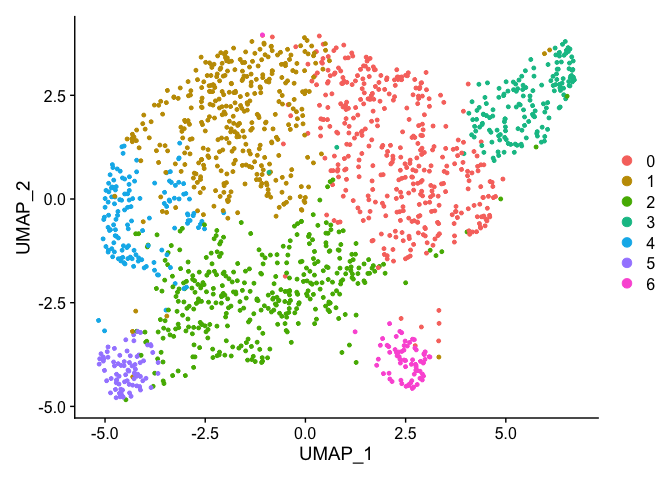
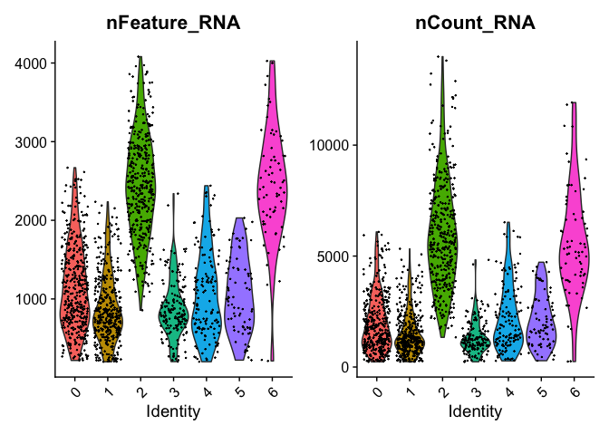
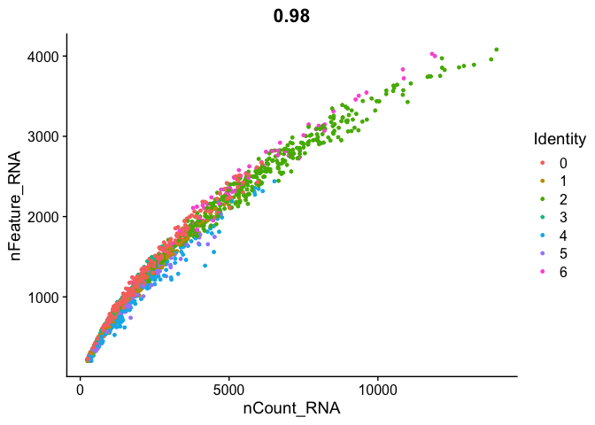
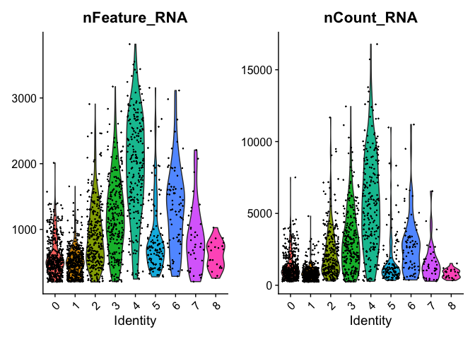
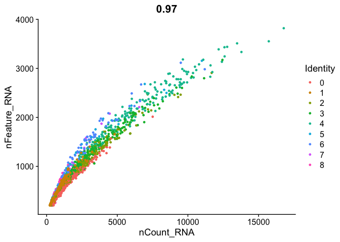
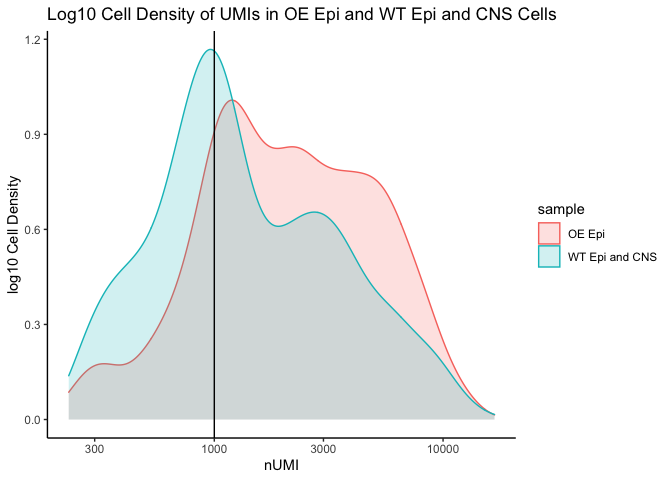
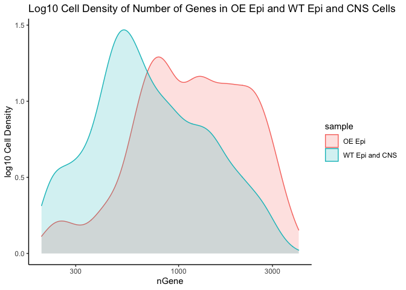

Final Pou4 Revision Code
================

#### This is supplemental code for additional visualizations and analyses.

###### **Note:** It is compatible with Seurat v.4.0.4.

###### **Revision Strategy:** Seurat objects “oe\_epi\_suerat” and “wt\_epi\_cns9\_seurat” present in environment generated from “final\_pou4\_analysis\_pipeline.Rmd” were loaded into this new environment, updated and then manipulated by this script.

``` r
library(Seurat)
library(edgeR)
library(dplyr)
library(Matrix)
library(ggplot2)
```

#### **Update Seurat objects from v2 to v3.**

#### First load objects.

``` r
file_path = "/Users/prakritipaul/Git/Pou4_Misexpression/pou4_revision_code_relevant_objects/"
oe_epi_seurat <- readRDS(paste0(file_path, "oe_epi_seurat.rds"))
wt_epi_cns9_seurat <- readRDS(paste0(file_path, "wt_epi_cns9_seurat.rds"))
```

#### **Revision 1:** Figure 2c.

###### Perform UMAP on OE Epi Seurat and visualize subclusters.

``` r
UMAPPlot(updated_oe_epi_seurat, reduction = "umap")
```

<!-- -->

#### **Revision 2:** Figures S16 and S18.

###### Visualize various quality control metrics in OE Epi and WT Epi and CNS seurats.

``` r
oe_vln_plot <- VlnPlot(updated_oe_epi_seurat, features = c("nFeature_RNA", "nCount_RNA"), ncol = 2)
oe_scatter_plot <- FeatureScatter(updated_oe_epi_seurat, feature1 = "nCount_RNA", feature2 = "nFeature_RNA")

wt_vln_plot <- VlnPlot(updated_wt_epi_cns9_seurat, features = c("nFeature_RNA", "nCount_RNA"), ncol = 2)
wt_scatter_plot <- FeatureScatter(updated_wt_epi_cns9_seurat, feature1 = "nCount_RNA", feature2 = "nFeature_RNA")

# For OE Epi Clusters.
oe_vln_plot
```

<!-- -->

``` r
oe_scatter_plot
```

<!-- -->

``` r
# For WT Epi and CNS Clusters.
wt_vln_plot
```

<!-- -->

``` r
wt_scatter_plot
```

<!-- -->

#### **Revision 3:** Figure S17.

###### Make Log10 Cell Density of UMIs (a) and Number of Genes (b) in OE Epi and WT Epi and CNS Cells

``` r
# Do for OE Epi.
oe_metadata <- updated_oe_epi_seurat@meta.data
oe_metadata$cells <- rownames(oe_metadata)
oe_metadata$sample <- "OE Epi"
oe_metadata$res.0.5 <- NULL

# Rename columns.
oe_metadata <- oe_metadata %>%
        dplyr::rename(nUMI = nCount_RNA,
                      nGene = nFeature_RNA)

# Do for WT.
wt_metadata <- updated_wt_epi_cns9_seurat@meta.data
wt_metadata$cells <- rownames(wt_metadata)
wt_metadata$sample <- "WT Epi and CNS"
wt_metadata$res.0.6 <- NULL

# Rename columns.
wt_metadata <- wt_metadata %>%
        dplyr::rename(nUMI = nCount_RNA,
                      nGene = nFeature_RNA)

# Combine OE Epi and WT Epi and CNS metadata.
all_meta_data <- rbind(oe_metadata, wt_metadata)
```

#### **Visualize.**

``` r
all_meta_data %>% 
    ggplot(aes(color=sample, x=nUMI, fill= sample)) +
    geom_density(alpha = 0.2) + 
    scale_x_log10() + 
    theme_classic() +
    ylab("log10 Cell Density") +
    geom_vline(xintercept = 1000) +
    ggtitle("Log10 Cell Density of UMIs in OE Epi and WT Epi and CNS Cells") 
```

<!-- -->

``` r
all_meta_data %>% 
    ggplot(aes(color=sample, x=nGene, fill= sample)) +
    geom_density(alpha = 0.2) + 
    scale_x_log10() + 
    theme_classic() +
    ylab("log10 Cell Density") +
    ggtitle("Log10 Cell Density of Number of Genes in OE Epi and WT Epi and CNS Cells") 
```

<!-- -->
